# Metrics

## Basic

### Lines of Code 

-   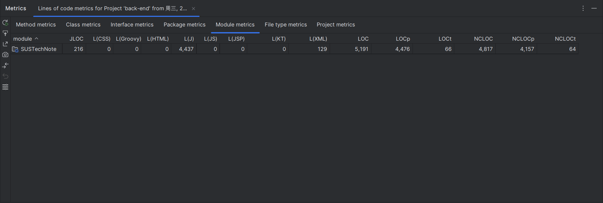
-   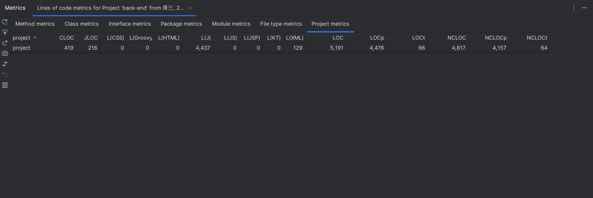
-   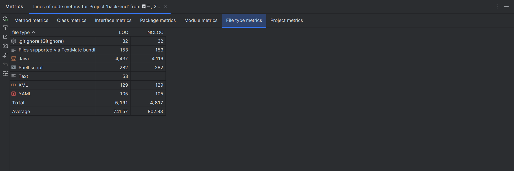

### Number of modules/subprojects 

-   

### Number of packages 

-   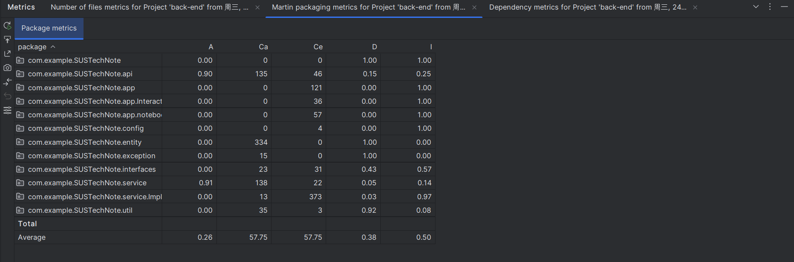

### Number of source files 

-   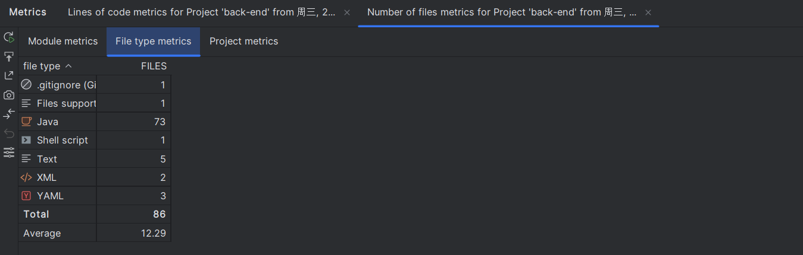

### Number of 3rd party dependencies

-   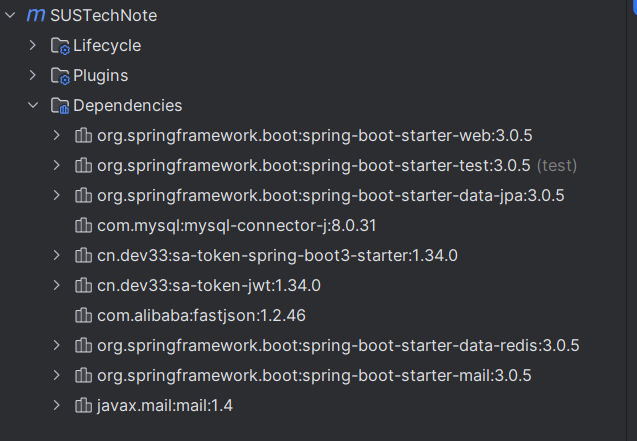

## Analyze the maintainability of your team project 

#### Collect the above five metrics of at least one popular open-source project (0.5 points)

项目地址：[redis/jedis: Redis Java client (github.com)](https://github.com/redis/jedis)

-   1、
    -   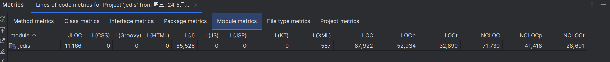
    -   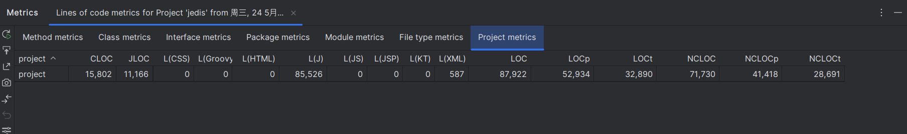
    -   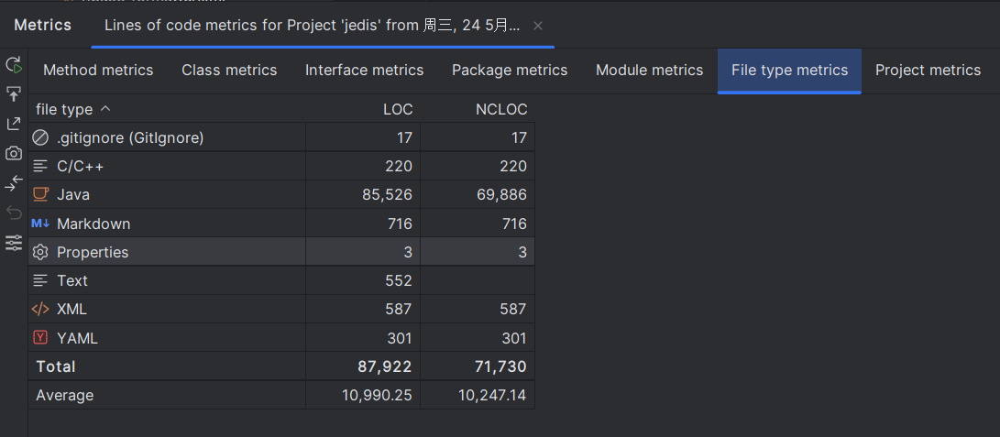
-   2、
    -   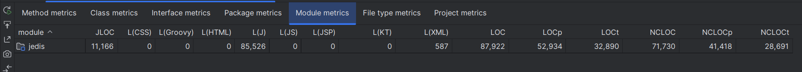
-   3、
    -   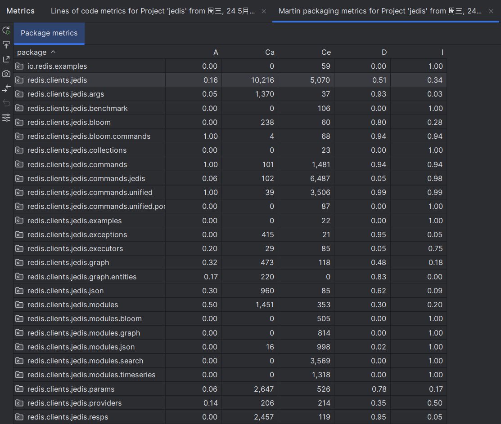
    -   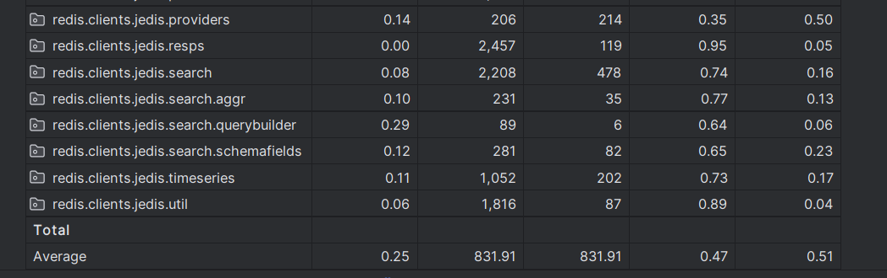
-   4、
    -   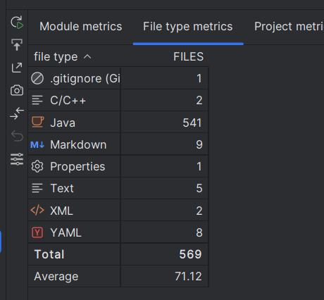
-   5、
    -   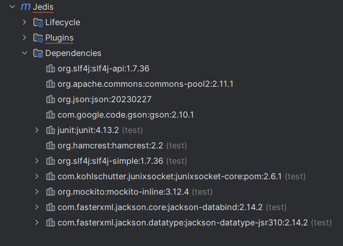

#### Compare the metrics with yours, and briefly analyze the maintainability (0.5 points)

| project     | Lines of Code (rate of non-comment) | Number of modules/subprojects | Number of packages | Number of source files | Number of 3rd party dependencies |
|-------------|-------------------------------------|-------------------------------|--------------------|------------------------|----------------------------------|
| SUSTechNote | 5191(93%)                           | 1                             | 11                 | 73                     | 10                               |
| jedis       | 87922(82%)                          | 1                             | 30                 | 541                    | 11                               |

##### maintainability 

###### 与Jedis相比：

-   没有注释的代码行数占比更多，不便于维护时快速了解一个函数的作用，因此可维护性相对较低

-   packages的数量更少，功能分区明显，在代码维护时能够快速定位到所需文件，可维护性较高

-   源代码文件较少，项目较小，功能相对简单，减小维护难度

-   第三方依赖库数量相当，不会过度依赖第三方库。

    