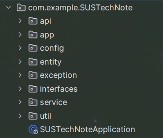
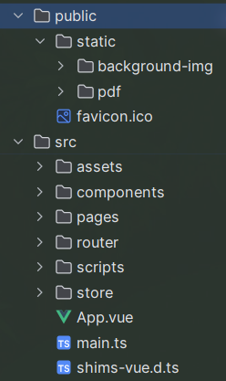

# SUSTech Note Share

SUSTech note share项目是一个专门为南科大师生打造的笔记分享平台，
该平台提供了便捷的文件上传和文本编辑功能，便于云端编辑笔记本。笔记本可以选择公开
以便其他用户查阅。笔记本也可以单独分享给个人或者群组。

该项目是一个前后端分离的项目，前端用到的技术栈是Vue3，后端用的是SpringBoot v3.

## Back End 后端

后端的相关文件位于`/back-end`文件夹下，使用的是SpringBoot v3框架。
项目使用maven构建，详情请查阅文件夹下的pom.xml文件。用户管理的部分我们
使用了satoken框架进行管理，其余部分使用的均是标准的SpringBoot框架内容。

### 项目结构（位于`src`文件夹下）

（由于早期经验不足，部分组件的命名并未遵守SpringBoot项目的一般实践）



* `api`下为JDBC相关的代码，用于与数据库进行交互
* `app`下为控制器，用于处理前端的请求
* `config`下为配置文件
* `entity`下为数据库实体类
* `exception`下为自定义异常类以及异常类的处理方法
* `interfaces`下为定义了前后端交互所需要使用的Json格式接口
* `service`下为服务类，用于处理业务逻辑
* `utils`下为工具类，此处放置了路径服务、Redis服务和Email服务的相关代码

### 运行
#### 安装依赖
```shell
mvn install
```
#### 运行
```shell
mvn spring-boot:run
```
#### 打包
```shell
mvn package
```
由于项目中并没有编写有意义的测试用例，因此在打包时会跳过测试用例的运行。
### 重要！
后端项目依赖于 MySQL 和 Redis 两种外部服务，需要在application-dev或者
application-prod中配置相关的登录信息。

后端运行过程中还需要接收大量来自前端的上传文件，因此需要在本地配置静态资源储存路径。
该配置应写于 Spring.web.resources.static-locations 配置中，带上`file:`前缀。项目
中配置的资源路径是相对路径`/static`

## Front End 前端

前端的相关文件位于`/front-end`文件夹下，使用的是Vue3框架，使用vite作为构建工具。
由于组内开发经验不一以及技术栈随着项目的进行不断更新，代码中会出现
JavaScript和TypeScript混用的情况，以及OptionsAPI和CompositionAPI混用的情况。
项目主体使用的UI框架为ElementPlus，使用Vuex作为状态管理工具，Vue Router作为导航工具。
使用了PDF.js(文件导入)作为pdf预览工具，monaco editor作为文本编辑工具。

项目配置了Eslint作为代码风格检查工具。但由于未知原因，Eslint在进行TypeScript代码检查
的时间会非常漫长，因此不建议在开发过程中开启Eslint实时检查。

### 项目结构


#### 静态资源
* `public/static/background-img`下为项目中使用的背景图片
* `public/static/pdf`下为渲染pdf所使用的pdfjs包
* `public/favicon.ico`为项目的图标
#### 项目主体
* `src/assets`下为项目相关图片和CSS资源
* `src/components`下为项目中使用的Vue组件，按其所属的页面进行分类
* `src/pages`下为项目中的页面，受vue router控制
* `src/router`下为项目的路由配置
* `src/scripts`下为脚本文件，主要为API的包装函数（便于组件中调用），也包含了Axios的拦截器配置
* `src/store`下为项目的状态管理配置，注意在typescript中所有store中的
类型都需要在vuex.d.ts中进行声明
* `App.vue`,`main.ts`和`shims-vue.d.ts`为Vue项目的启动文件

### 运行

脚本也可以在package.json中进行查看

#### 安装依赖
```shell
npm install
```
#### 本地测试运行
```shell
npm run dev
```
#### 执行语法检查和格式修复
```shell
npm run lint
```
#### 打包
```shell
npm run build
```
#### 打包为docker容器
```shell
docker build -t note-share-front-end .
```
其中的`note-share-front-end`为容器的名称，可以自行修改

## 其他可能有用的文档

Github repo：https://github.com/sustech-cs304/team-project-117/tree/dev

界面UI设计：https://mastergo.com/goto/oCyvZyyr?file=86539817931484

API文档：https://www.eolink.com/share/index?shareCode=IVHSky