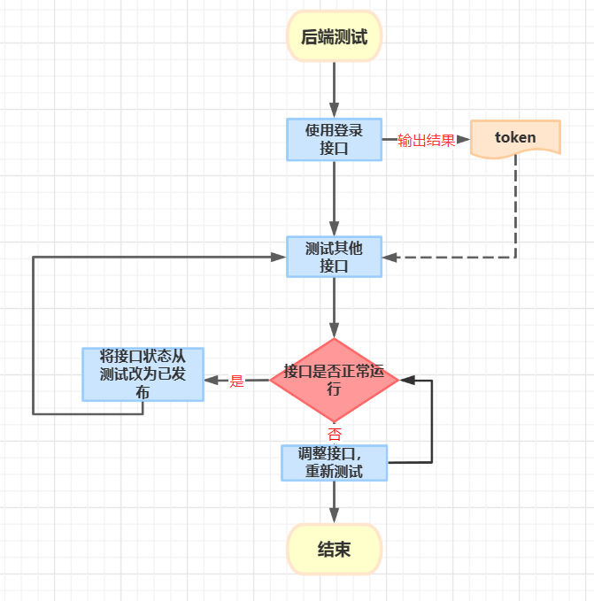
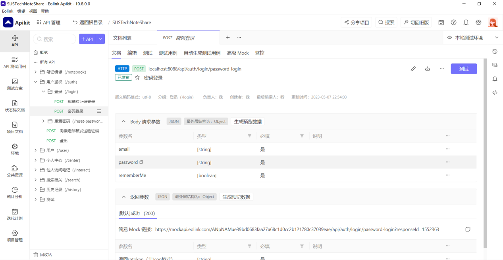
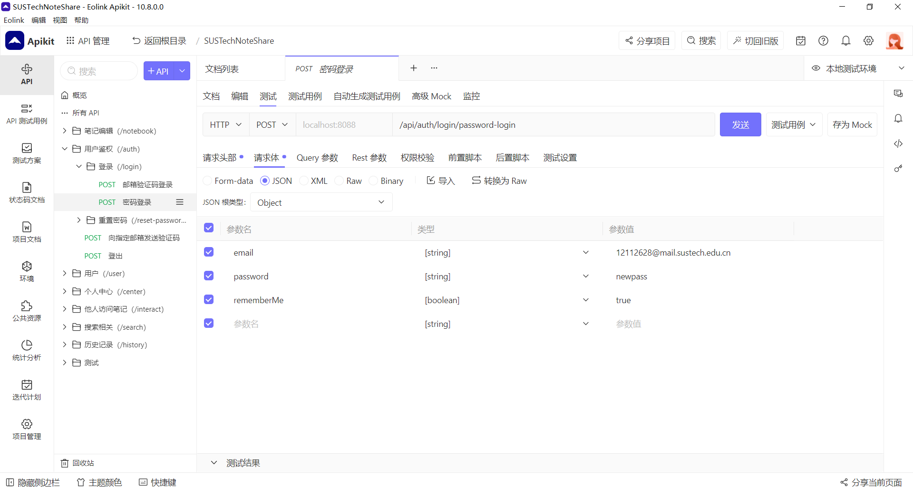
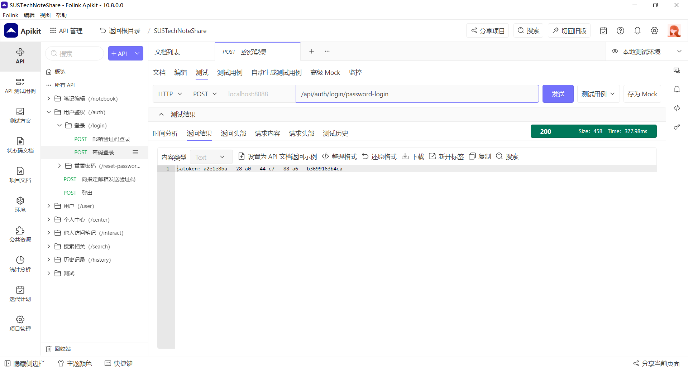
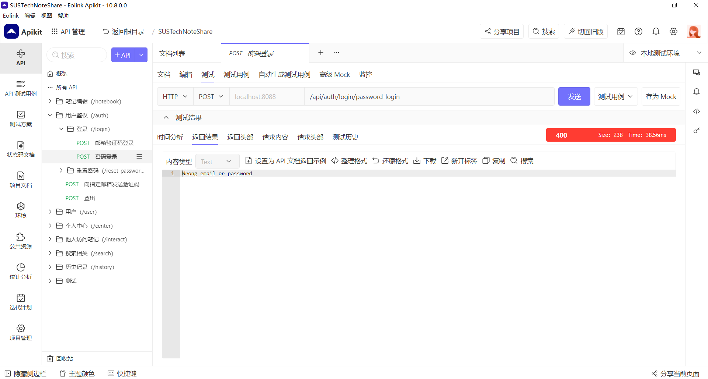
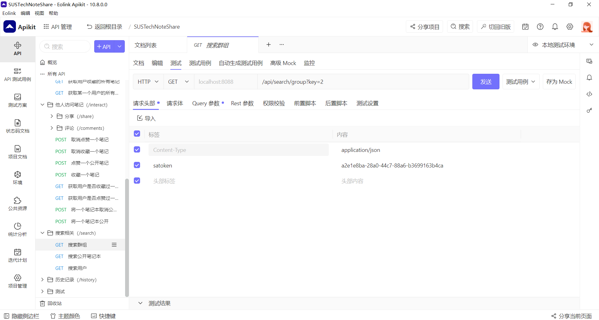
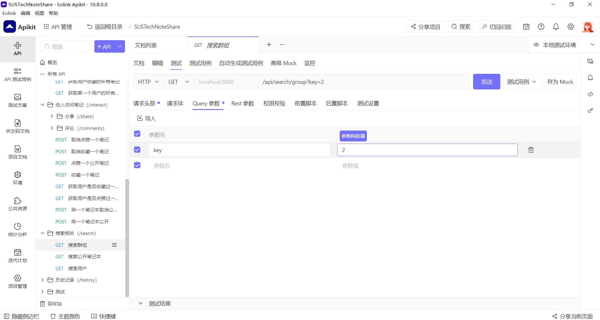
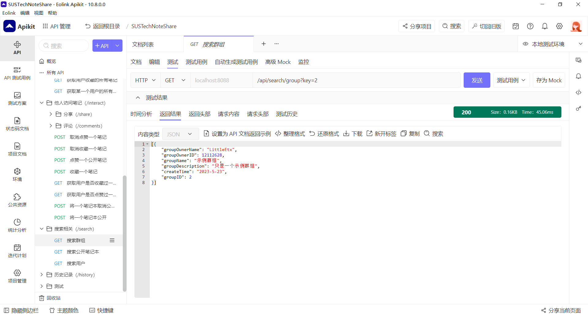

## test part
The testing method for this software engineering project 
is manual testing. The reason for not using automated testing 
is that manual testing has been adopted from the beginning of 
the project. By the end of the project, 
the development time for project functions is relatively tight. 
At this time, switching to automated testing would face many 
difficulties, such as the need to spend a lot of time to write 
and maintain automated testing scripts, and the results obtained 
in the end won't be much better than manual testing. 
After weighing the pros and cons, our team still chose to use 
manual testing for the project.

## software and process for test
In this project, our team uses a testing software called eolink. 
This software not only provides API development documentation 
but also offers us interface testing capabilities. 
Front-end development members first fill out the API 
documentation in eolink, specifying the required data, 
format, and related requirements. After reviewing the documentation,
back-end development members write the back-end interfaces according
to the requirements of the documentation. Once completed, 
the back-end members will create reasonable test data based 
on the requirements, and fill it in the testing module of 
eolink to start testing. The back-end testing process is shown 
in the diagram.

## **example for test**
*   Here is an example of how our team uses eolink for testing.

*   We start with a login operation. 
    

    From the above image, we can see the interface path and required parameters for the password login function. Click on the test button on the right to enter the test interface.
    
    In the test interface, we have prepared test cases (which can also be adjusted according to actual conditions). Clicking the send button in the upper right corner will send a request to the server for testing, and return corresponding results based on different test data.

    
    If the login fails, the reason for failure will be returned.

    
    If the login is successful, the user's token will be returned. We can use this token to test other interfaces.

*   After obtaining the token through the login operation, we can conduct tests on other interfaces. Here we will take 'searching for the user's group' interface as an example.
    
    First, fill in the request header with the token returned by the login interface.
    
    Then fill in the parameters for testing.

    
    Finally, compare the return value with the data in the database to determine whether the interface is running normally. After confirming that there are no errors, change the status of the interface from 'testing' to 'published'. The same process can be applied to test other interfaces.
