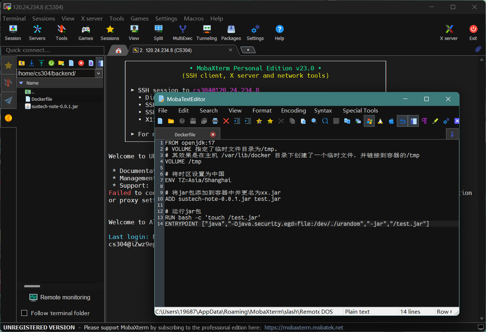
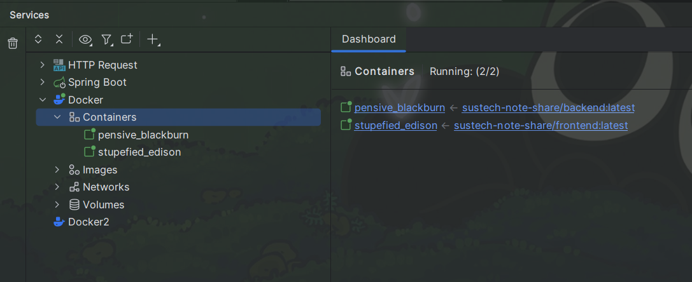

# [CS304] Milestone 3 Report

Project Team ID: 117

Project Name: SUSTech Note Share

Project Member: 陈孙兵，黄宇海，杨子德，李田，徐立达

## 1. Metrics

See [Metrics.md](Metrics.md)

## 2. Documentation

### 2.1 User Reference
See [UserReference.pdf](UserReference.pdf)
### 2.2 Developer Documentation
See [README.md](README.md)

## 3. Tests
See [Tests.md](Testing.md)

## 4. Build
#### Backend (SpringBoot)
For the backend, we use `maven` to manage the dependencies and build the project.
Relative code can be found in [pom.xml](back-end/pom.xml) file.
By running `mvn package`, the project will be built and the jar file will be generated in `target/` directory.

#### Frontend (Vue.js)
For the frontend, we use `npm` to manage the dependencies and build the project.
Relative code can be found in [package.json](front-end/package.json) file.
By running `npm run build`, the project will be built and the static files will be generated in `dist/` directory.

## 5. Deployment
For both backend and frontend, we use `docker` to deploy the project.
The final deployed service can be reached at http://120.24.234.8:8080.
(Note: Since the server is deployed on a low-performance and low-bandwidth VM brought from AliCloud, it may take a while to load the page.)
### 5.1 Backend

For the backend deployment, we first transmit the packaged jar file
to the server and build the docker image on fly. The `Dockerfile`
is demonstrated in the figure above. A simple openjdk java image is used.
### 5.2 Frontend
For the frontend deployment, we first build the docker container on local machine
to test the usability. Here is the [Dockerfile](front-end/Dockerfile).
The service is deployed on the nginx. Its configuration file is [nginx.conf](front-end/default.conf).

After the checking the usability, we transmit the docker image to the server
via IDEA docker tool. Then we run both the frontend and backend container on the server.