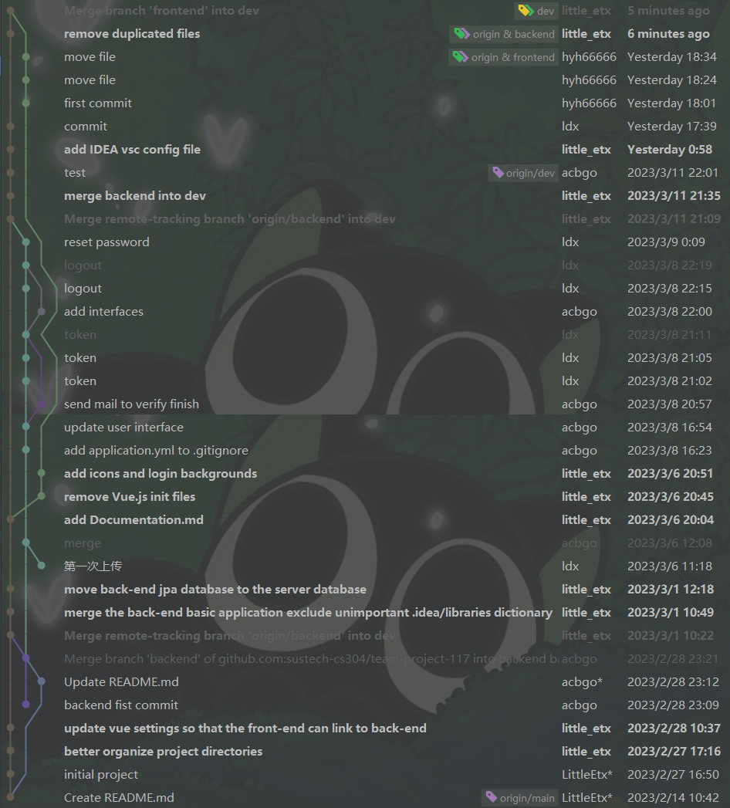
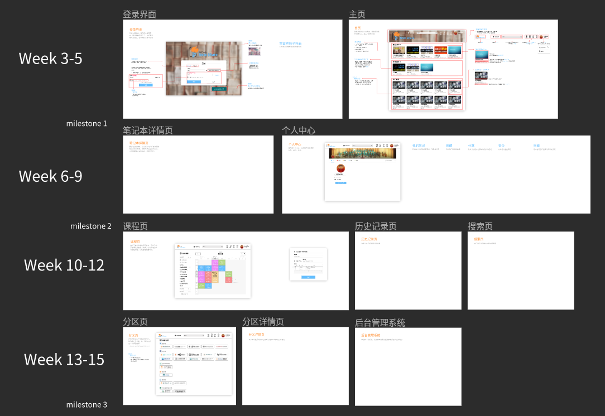

# [CS307] Milestone 1 Report

Project Team ID: 117

Project Name: SUSTech Note Share

Project Member: 陈孙兵，黄宇海，杨子德，李田，徐立达

## Revision History

## 1. Overview

### 1.1 Motivation and Background

Current day, there exist much excellent note-taking software, such as OneNote, Evernote, etc.
However, with different platforms, formats and accounts,
they are not suitable for sharing notes among SUSTech students.
For this reason, students form tones of QQ groups to share notes
for different courses. However, this method is not convenient and efficient.

In order to solve this pain spot, we plan to develop a note-sharing platform,
on which students can store their notes on the cloud and share or public their notes,
benefiting all the students behind them.

### 1.2 Target User or Clients Characteristics

Target users are SUSTech students and teachers.

Users can reach their notes via browser and upload their notes to the platform.
While most of the files in the note, such as pdf or ppt,
are uploaded and previewed only,
text file editing is supported on the browser.

Each note is associated with a course, and users can search notes by courses or departments.
Users can also share their notes with other users, or visit those public notes.
To make the process more convenient,
users can also star their favorite notes or get the browsing history.
Users can create syllabus for their courses and build their notes basing on the syllabus.

In addition to sharing notes, we also expect users to share course materials,
resources and other interesting things on the platform.

### 1.3 Project Scope

Since the platform is for SUSTechers only,
we will provide registration and login means only via SUSTech email.

As a web service, we will separate the front end and the back end.
The front end is the user interface,
which is used to display the notes and the information of the users.
The back end is the server,
which is used to store the data and provide the API for the front end.

The back end will also use many third-party services, such as
MySQL, Redis, etc.

### 1.4 Overall Goal

The overall goal of this project is to develop a note-sharing
platform for SUSTechers.

User can upload files or use online text editor to build notes.
Notes can be shared to other users or made public.

When students wants to review a course,
they can easily find those well-made notes on the platform. The platform can also
be served as a platform for share course materials and resources.

## 2. Development Process

### 2.1 Process Models

We use SCRUM as our development process model.

Since scrum is a role-strictly-defined model with fix workload in each sprint,
we can easily divide the workload and trace development process.
If something goes wrong in one sprint, we can try to fix it in the latter sprints
and revise our product expectation.

The overall process contains four sprints.
At the fist weekend of each sprint, we will discuss the functions to be achieved
basing on draft design (which is demonstrated in [MasterGo](https://mastergo.com/goto/p6aGhJwp?file=86539817931484)).
Then specific workload is distributed to every team member, and traced via GitHub project,
which serves as the scrum board for our project.

Every weekend, we will meet together to check progress and solve problems.

### 2.2 Project Schedule

In the first sprint(week 3-5), we will finish user authority function, allowing users
to login, log out and reset their password.

In the second sprint(week 4-9), we will build the core functionality,
i.e. the notebook system. The personal center is also developed in this sprint,
allowing users to manage their notes and profile.

In the third sprint(week 10-12), we will focus on the share system, allowing users
to share their notes with other users or make them public, allowing other users search for them.
History and favorite system will also be developed in this sprint. Basing on our progress,
we will decide whether the schedule system will be implemented.

In the fourth sprint(week 13-15), we will focus on the course system, allowing users
to go the pages of each department and view all the public notes of specific courses under that department.
We will also beta test the system to as many users as possible and test its stability.
If time permits, we will also implement management system.

### 2.3 Roles of Team Members

| Name | Role                | Responsibilities                                               |
|------|---------------------|----------------------------------------------------------------|
| 李田   | Project Manager     | Project schedule and management, function design, UI design    |
| 陈孙兵  | Back-end Leader     | Leader of back-end development, distribute back-end workload   |
| 徐立达  | Back-end Developer  | Back-end development, document and test API                    |
| 杨子德  | Front-end Leader    | Leader of front-end development, distribute front-end workload |
| 黄宇海  | Front-end Developer | Front-end development, documentation                           |

### 3. Suggested Deliverables

### 3.1 Milestone 2 Deliverable

Complete 70% of the basic functions of the whole project
and complete the interaction and functional test of the front and back ends,
including the login registration function, the view history access record function,
the class schedule import function, and the note recording function.
The note recording can upload pictures, and the notes can be sorted, merged, and exported.

We will put our documentation and test suits on API management system [eolink](https://www.eolink.com).

### 3.2 Milestone 3 Deliverable

Complete all basic functions of the project,
beautify the page and optimize the function.
For example, it has automatic login function, public sharing (by course category)
and friend sharing, sharing to groups, cloud function, orc recognition of handwritten text.

Since this is a web service platform, no deliverables is required for the clients.
We will release the web service on our server so that everyone can use it.

## 4. Requirements

### 4.1 Functional Requirements

#### 4.1.1 User can register and login via SUSTech email

* User can log in via password or email verification code.
* When new user login verification code,
  the user is automatically registered.
* User can select 'remember me', so that when the user enter the platform next time,
  logging in is not required.
* When the user forget password, the user can renew the password by email verification code.
* After logging in, the user can log out.
* User can change their password in the personal center.

#### 4.1.2 Users have personal profile

* Users can view and edit their profile,
  including their name, avatar, birthday, gender and description.
* When visiting other users' personal center, their profile are also displayed.

#### 4.1.3 Users can build their notes online

* Users can create new notebooks, edit existing notebooks and delete notebooks.
* Each notebook is associated with a course, so that users view all their notebooks
  in the personal center, cataloged by courses.
* In each notebook, users can create new notes, edit existing notes and delete notes.
  Each note serves like a directory, in which users can upload or delete files, and move files between notes.
* When user delete files, the files will be temporarily stored in the recycle bin,
  in case of accidental deletion.
* When users select a file in a note, they can preview the file (picture, pdf, etc).
  Additionally, text files is provided with a text editor, so that users can edit the file online.
* Users can download files separately, files within a note or all the files in a notebook.
* Users can search for his notebooks in the personal center.

#### 4.1.3 Notebooks can be shared, public, liked, stared and commended

* Users can share notebooks to other users.
  They can see all the notebooks shared to them in the personal center.
* Users can make notebooks public, so that other users can search for them.
* When visiting others notebooks, users can like them. The like number
  will be displayed with the notebook. Users can also star public notebooks,
  so that they can find them easily in the personal center.
* If users try to visit a notebook that is neither shared to them nor public,
  the request will be denied(404).
* Users can commend public notebooks, and the commendation will be displayed below the notebook.
  Commendation can be deleted by the user who commended it. Commendation can be liked and disliked,
  and the like number will be displayed with the commendation.

#### 4.1.4 Users can view their history

* Users can view their history in the history page, where they can see
  all the notebooks they have visited, sorted by time.
* Users can delete some of their history or clean all.
* History can be filtered by whether the notebook is created by the user.
* Users can search in their history

#### 4.1.5 Users can search for public notebooks

* Users can search for public notebooks in the search page, and set limitations on the search.
* A main site is set for each department, and users can
  find all the public notebooks of a course in that department.

#### 4.1.5 Users can form groups and share notebooks to groups

* Users can create groups, and invite other users to join the group
  or remove current group members.
* Users can exit any group they have joined in.
* Users can view all the groups they have joined in the personal center.
* All the members of a group can be viewed in the group page.
* Notebook can be shared to a group, so that all the members of the group can view it.

#### 4.1.6 Users can build their syllabus and link to their notebooks

* Users can import their syllabus from TIS, or manually add and delete courses to their syllabus.
* Users can link their notebooks to their syllabus, so that they can add notes to the notebooks
  or view relating notes by clicking the syllabus.
* The current time is traced in the syllabus, so that users can know which course is ongoing.

#### 4.1.7 Public notebooks can be managed

* Administrators can view all the public notebooks lock improper ones.
  Locked notebooks cannot be viewed by anyone except for the owner.

### 4.2 Non-Functional Requirements

#### 4.2.1 Quality requirements

* The interface is simple and easy to use, avoiding the existence of too many redundant components
* The functions of each module are clear and include necessary functions

#### 4.2.2 Reliability requirements

* Able to handle exceptional situations correctly and avoid server crashes
* Need to be reliable and stable enough not to lose user information due to server crashes
* Low latency: Avoid too long request time when users request data

#### 4.2.3 Safety requirements

* #### 4.2.3.1 Data security
    * Users' personal notes are regularly copied to avoid loss
    * Access control to protect the visibility of user data
* #### 4.2.3.2 Personal information
    * Passwords are encrypted to prevent password leakage
    * Users need email verification to change passwords.

## 5. Constraints

### 5.1 Operation Environment

The back end and front end will both be deployed on a server.
Our current plan is on a Ubuntu server rented from Alibaba Cloud.
User can access the website through a browser. Only PC version of web pages are supported.

### 5.2 Design and Implementation

The backend is powered by SpringBoot v3.0.2, basing on Java 17, and we use saToken library for authentication.
The backend environment also includes MySQL 8.0.26 and Redis 6.2.5.

The frontend is powered by Vue 2. Later we will try to update it to Vue 3, if possible.

