# [CS307] Milestone 2 Report

Project Team ID: 117

Project Name: SUSTech Note Share

Project Member: 陈孙兵，黄宇海，杨子德，李田，徐立达

## 1. Requirements Modeling & Design

### 1.1 Use Case Diagram

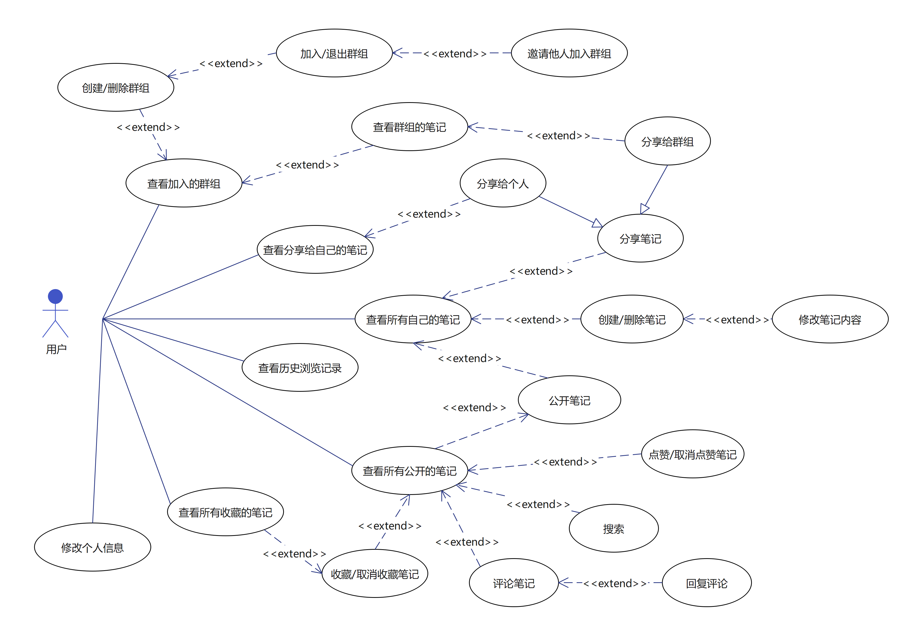

The core user case is that user can create notes and edit them.
After that, they can choose to public their notes or share their notes to a certain group.
Notes can be shared either to a group or to someone else.

Here come user cases involving groups. Users can create groups and invite others to join,
Within a group, users can share notes to the group and the group members can see the notes, 
no matter the note is public or not.

When user choose to publish notes, everyone can see the notes,
and they can like, star and comment on the notes.

### 1.2 Swimlane Diagram (for viewing notes within Group)

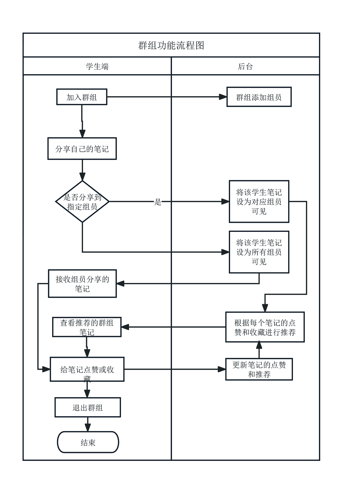

This diagram specifies the interaction between the user and 
the system when the user want to use group function. 
After joining a group, the user can share his notes to the group
hence the group members can see the notes.

Alternatively, if the user choose to public his notes, 
then everyone can see the notes. Here a system will be introduced
to recommend notes to users basing on the popularity of notes
as well as the exploring history of the user.

### 1.3 Natural Language Description (for modifying user information)

#### Meta Data

| Metadata         | Value                                                                                |
|------------------|--------------------------------------------------------------------------------------|
| Name             | Modify user information                                                              |
| Actor            | User                                                                                 |
| Goal             | Enable users to improve and modify their personal information                        |
| Trigger          | User click the button to modify user information in personal center                  |
| Entry conditions | User has logged in and currently is in personal center                               |
| Post conditions  | Modification has been uploaded to the back-end server and the server returns success |

#### Basic Flow
1. User click the button to modify user information in personal center
2. The user information displayed on the left will become editable
3. User finish editing and click the button to submit
4. The front-end checks whether the input is valid, if not, it will prompt the user to re-input,
    otherwise, it will send the modification to the back-end server
5. New user information will be displayed on the left when the back-end
    server returns success

#### Alternative Flow
3. User click the cancel button to discard any modification

#### Error Flow
5. The back-end server returns failure, the information will not be modified

### 1.4 Diagrams for Logical View

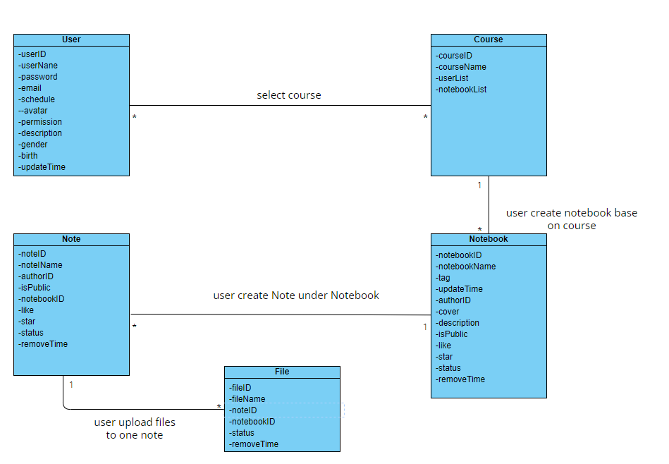

This logic diagram specifies then classes involved in the note system.
Basically, a user owns multiple notebooks. In each notebook, users can 
create multiply notes. Each note is essentially a directory, and many
files can be included in each of the notes.

To bound notebooks to courses, we introduce a tag attribute to the notebook.
While tags can be chosen from a provided course list, user can also choose
to use their custom tags.

### 1.5 Data Design

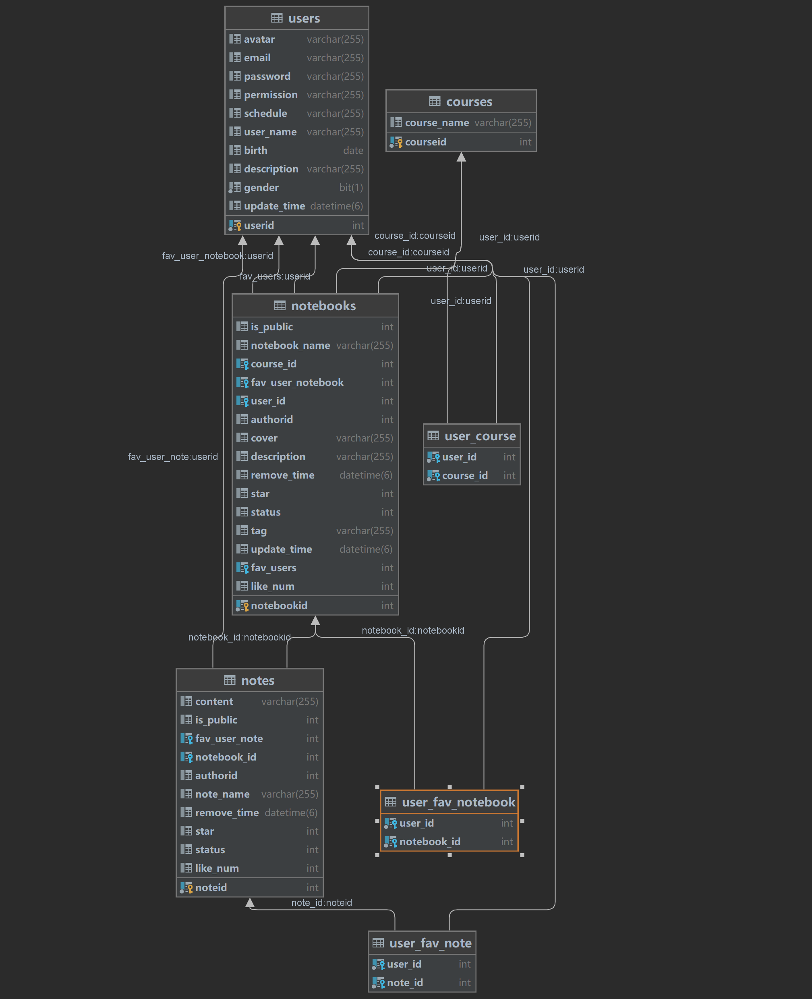

Since we use MySQL as back-end database, a database schema is provided.
Besides identity tables (which are identical to the class diagram in 1.4), 
relationship tables are also included in the schema. Belows are the
specifics of the tables:

#### User
- **userID(Integer):** User identity, obtained from email
- **userName(String):** User name
- **password(String):** User password
- **email(String):** User email
- **schedule(String):** URL for importing class schedule
- **avatar(String):** URL for user's avatar
- **permission(String):** User permissions
- **description(String):** User signature
- **gender(String):** User gender
- **birth(Date):** User birthday
- **updateTime(LocalDateTime):** The last time the user's information was updated, used to prevent users from updating their information too frequently

#### Course
- **courseID(Integer):** Course identifier
- **courseName(String):** Course name
- **userList(List<User>):** Users studying the course
- **notebookList(List<Notebook>):** Notebooks related to the course

#### Notebook
- **notebookID(Integer):** Notebook identifier
- **notebookName(String):** Notebook name (named by the user)
- **tag(String):** Course category, e.g., cs202-Computer Organization Principles
- **updateTime(LocalDateTime):** The last time the notebook was updated
- **authorID(Integer):** The author's user ID of the notebook
- **cover(String):** Notebook cover URL
- **description(String):** Notebook description
- **isPublic(Integer):** Whether the notebook can be accessed publicly, 1 represents yes, 0 represents no
- **like(Integer):** Number of likes for the notebook
- **star(Integer):** Number of times the notebook has been favorited
- **status(Integer):** Used to maintain the recycle bin feature, status 0 allows normal access, -1 means deleted (invisible to users)
- **removeTime(LocalDateTime):** The last time the notebook was deleted (when the status changed to -1), if not restored within 7 days, it will be removed from the database.

#### Note
- **noteID(Integer):** Note identifier
- **noteName(String):** Note name
- **authorID(Integer):** The author's user ID of the note
- **isPublic(Integer):** Whether the note can be accessed publicly, 1 represents yes, 0 represents no
- **notebookID(Integer):** The ID of the notebook to which the note belongs
- **like(Integer):** Number of likes for the note
- **star(Integer):** Number of times the note has been favorite
- **status(Integer):** Used to maintain the recycle bin feature, status 0 allows normal access, -1 means deleted (invisible to users)
- **removeTime(LocalDateTime):** The last time the note was deleted (when the status changed to -1), if not restored within 7 days, it will be removed from the database.

#### File
- **fileID(Integer):** File identifier
- **fileName(String):** File name
- **fileUrl(String):** File URL
- **noteID(Integer):** The ID of the note to which the file belongs
- **status(Integer):** Used to maintain the recycle bin feature, status 0 allows normal access, -1 means deleted (invisible to users)
- **removeTime(LocalDateTime):** The last time the file was deleted (when the status changed to -1), if not restored within 7 days, it will be removed from the database.

### 1.6 UI Design

#### Login Page

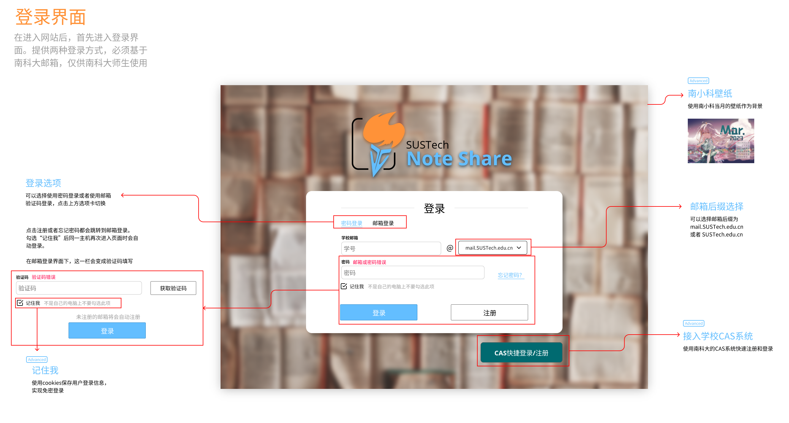

This page is specially designed since we want to specify the login and register process.

#### Main Page

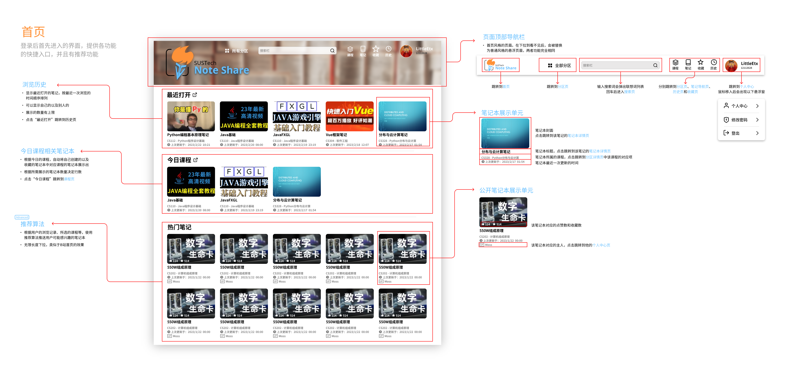

Main page is the first page that users will see after logging in.
This page provides entries to other pages, such as personal center and history.
User can also found recommend notes here.

#### Personal Center

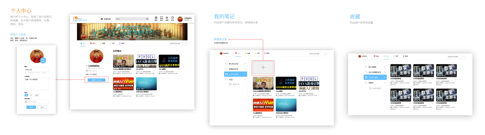

Personal center is where users can find all information about themselves,
including their own notes, stared notes and groups they joined.

#### Notebook Page

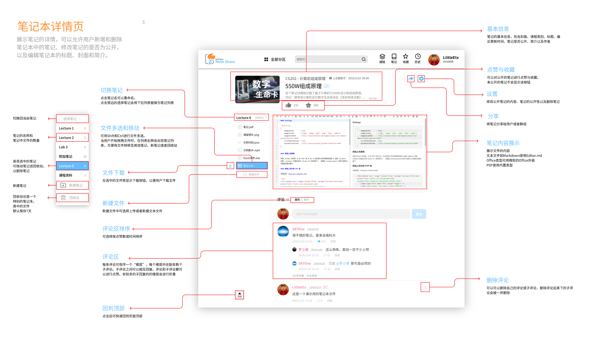

Notebook page is where users edit notes.
For public notes, likes, stars and comments are also displayed.

## 2. Collaborations

### 2.1 commit distribution

| User Name  | Real Name | Commit Times | Percentage |
|------------|-----------|--------------|------------|
| little-etx | 李田        | 47           | 57%        |
| acbgo      | 陈孙兵       | 19           | 23%        |
| ldx        | 徐立达       | 9            | 14%        |
| hyh666666  | 黄宇海       | 5            | 6%         |

**NOTE:** The commits above **CANNOT** represent the real case of contribution.
While some teammates tends to commit more frequently, others may tend to commit large changes,
but less frequently. Additionally, some commits by 李田 are used to set the development environment
and regular project structure, which should not be count as part of the contribution. 
杨子德 has not yet merge his work to the repository, so his commits are not tracked.

### 2.2 commit history

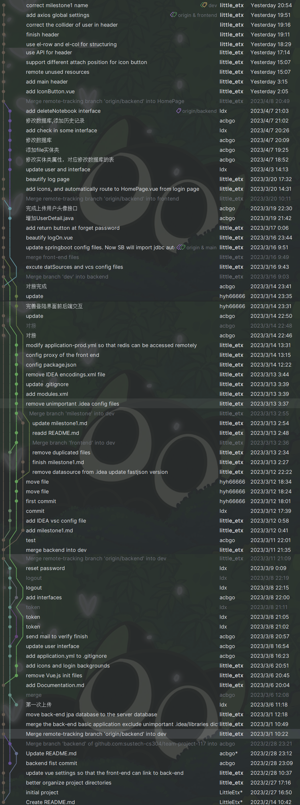

## 3. Deliverables

### 3.1 Current process

So far we have finished the following deliverables:
- User Authorization: login, registry and reset password
- Main page: header for navigation

### 3.2 Documentation

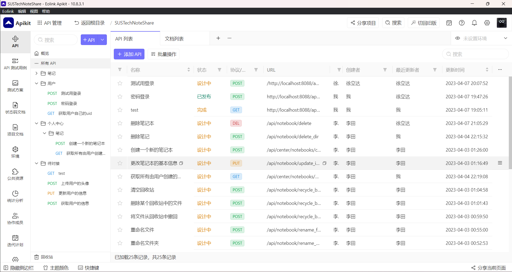

As a web application, we use _Eolink Apikit_ to manage our API documentation.
The page is accessible via [this link](https://www.eolink.com/share/index?shareCode=IVHSky)

### 3.3 Codes

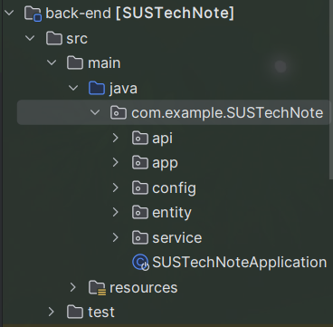

Back-end is powered by SpringBoot using java. Major source codes
are in `back-end/src/main/java`

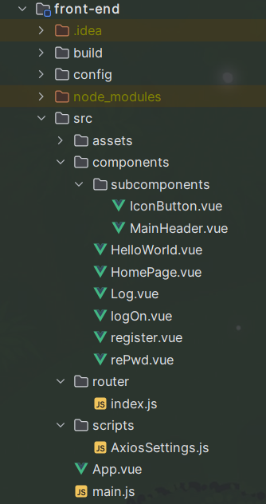

Front-end is powered by Vue 2. Major source codes
are in `front-end/src`
